# PolarFire® FPGA SDI/HDMI Bidirectional Converter Design

## Introduction

This repository contains a high-performance SDI/HDMI Bi-Directional protocol conversion solution built on Microchip's PolarFire® Video Kit. The platform connects an SDI/HDMI source to an SDI/HDMI sink, utilizing the energy-efficient and reliable MPF300T PolarFire Field Programmable Gate Array (FPGA).

The solution supports Bi-Directional SDI/HDMI conversion at data rates from 270 Mbps to 12G, ensuring it works with a wide range of professional video equipment and broadcast standards. Its real-time processing architecture delivers low latency and high-quality video transmission, making it suitable for broadcast, medical imaging and industrial video applications. By leveraging Microchip's advanced FPGA technology, along with HDMI RX IP, HDMI TX IP, SDI TX IP, SDI RX IP and development tools, this solution provides a scalable and efficient approach to SDI/HDMI conversion, addressing the evolving needs of modern video infrastructure.

This repository describes the implementation of two video paths on the PolarFire FPGA — SDI to HDMI and HDMI to SDI conversion — with the following functions:

- **Dynamic Resolution Adaptation and Real-Time Protocol Conversion**
  - **SDI to HDMI Protocol Conversion**: Automatically detects and adapts to various SDI data rates (270 Mbps, 1.5G, 3G, 6G and 12G) and input resolutions (such as 525i, 720p, 1080p and 4K), dynamically reconfiguring in real-time to ensure seamless video output on the HDMI Sink without manual intervention or system reset.
  - **HDMI to SDI Protocol Conversion**: Automatically detects and adapts to various HDMI input resolutions (such as 525i, 720p, 1080p and 4K), dynamically reconfiguring in real-time to ensure seamless video output on the SDI Sink, supporting multiple SDI data rates (270 Mbps, 1.5G, 3G, 6G and 12G) without manual intervention or system reset.
- **Plug-and-Play Operation**: Users can connect different SDI/HDMI sources with varying resolutions, and the system will automatically handle the conversion and output without requiring configuration changes.
- **Monitoring and Diagnostics**: UART messages provide real-time information on input resolution, SDI/HDMI input data rate, detection of unsupported resolutions and signal loss. This information is crucial for effective debugging and system monitoring.

## Table of Contents

- [Introduction](#introduction)
- [Table of Contents](#table-of-contents)
- [Features](#features)
- [Supported Resolutions](#supported-resolutions)
  - [SDI to HDMI 2.0](#table-1-supported-sdi-to-hdmi-20-video-and-audio-resolutions)
  - [HDMI 2.0 to SDI](#table-2-supported-hdmi-20-to-sdi-video-and-audio-resolutions)
- [Tested Devices](#tested-devices)
- [Demo Requirements](#demo-requirements)
- [Demo Prerequisites](#demo-prerequisites)
- [Setting Up the Demo](#setting-up-the-demo)
  - [Setting Up the Hardware](#setting-up-the-hardware)
  - [(Optional) Setting up the Serial Terminal](#optional-setting-up-the-serial-terminal)
- [Running the Demo](#running-the-demo)
- [Design Resource Utilization](#design-resource-utilization)
- [Design Overview](#design-overview)
  - [Data Path](#data-path)
  - [Libero Design Implementation](#libero-design-implementation)
  - [Transceiver and IP Configuration](#transceiver-and-ip-configuration)
  - [Clocking Structure](#clocking-structure)
  - [Reset Structure](#reset-structure)
- [Appendix A: Running the Tcl Script](#appendix-a-running-the-tcl-script)
- [Appendix B: Programming with FlashPro Express](#appendix-b-programming-with-flashpro-express)
- [Appendix C: Troubleshooting Guide](#appendix-c-troubleshooting-guide)
  - [Video and Signal Issues](#video-and-signal-issues)
  - [LED Status Decoding](#led-status-decoding)
  - [Serial and UART Issues](#serial-and-uart-issues)
  - [Hardware Setup Issues](#hardware-setup-issues)
  - [Unsupported Resolution or Data Rate](#unsupported-resolution-or-data-rate)
- [Documentation and Support](#documentation-and-support)
- [Glossary](#glossary)

## Features

The supported features of the SDI/HDMI converter design are as follows:

- **SDI to HDMI converter path**
  - Supports dynamically configurable color depths of 8-bit, 10-bit, and 12-bit.
  - Supports RGB, YUV444, and YUV422 color formats.
- **HDMI to SDI converter path**
  - Supports dynamically configurable color depths of 8-bit, 10-bit, and 12-bit.
  - Supports RGB, YUV444, and YUV422 color formats.
- Both converter paths support runtime reconfiguration of video format parameters.
- Both converter paths process four pixels per clock cycle.
- HDR (4K60) support for both paths.

## Supported Resolutions

The following tables list the supported SDI to HDMI and HDMI to SDI converter path video resolutions and audio rates.

  
<b>Table 1.</b> Supported SDI to HDMI 2.0 Video and Audio Resolutions

| Video Resolution | Frame Rate | Color Space | Bit Width (Bits) | SDI Data Rate |
| :---: | :---: | :---: | :---: | :---: |
| 720x480 | 59.94i | YCbCr 4:2:2 | 10 | 270Mbps |
| 720x625 | 50i | YCbCr 4:2:2 | 10 | 270Mbps |
| 1280x720 | 50p/30p/29.97p/25p | YCbCr 4:2:2 | 10 | 1.5G |
| 1280x720 | 50p/30p/29.97p/25p | RGB 4:4:4 | 10 | 1.5G |
| 1280x720 | 50p/30p/29.97p/25p | YCbCr 4:4:4 | 10 | 1.5G |
| 1920x1080 | 30p/29.97p/25p | YCbCr 4:2:2 | 10 | 1.5G |
| 1920x1080 | 60i/59.94i/50i | YCbCr 4:2:2 | 10 | 1.5G |
| 1920x1080 | 60p/59.94p/50p | YCbCr 4:2:2 | 10 | 3G |
| 1920x1080 | 30p/30psf/29.97p/29.97psf | RGB 4:4:4 | 10 12 | 3G |
| 1920x1080 | 30p/30psf/29.97p/29.97psf | YCbCr 4:4:4 | 10 12 | 3G |
| 1920x1080 | 30p/30psf/29.97p/29.97psf | YCbCr 4:2:2 | 12 | 3G |
| 1920x1080 | 25p/25psf | YCbCr 4:2:2 | 10 | 3G |
| 1920x1080 | 25p/25psf | RGB 4:4:4 | 10 | 3G |
| 1920x1080 | 25p/25psf | YCbCr 4:4:4 | 10 | 3G |
| 1920x1080 | 60i/59.94i/50i | RGB 4:4:4 | 10 12 | 3G |
| 1920x1080 | 60i/59.94i/50i | YCbCr 4:4:4 | 10 12 | 3G |
| 1920x1080 | 60i/59.94i/50i | YCbCr 4:2:2 | 12 | 3G |
| 4096x2160 | 30p/29.97p/25p/24p/23.98p | YCbCr 4:2:2 | 10 | 6G |
| 3840x2160 | 30p/29.97p/25p/24p/23.98p | YCbCr 4:2:2 | 10 | 6G |
| 3840x2160 | 60p/59.94p/50p | RGB 4:4:4 | 10 | 12G |
| 3840x2160 | 60p/59.94p/50p | YCbCr 4:4:4 | 10 | 12G |
| 3840x2160 | 60p/59.94p/50p | YCbCr 4:2:2 | 10 | 12G |
| 3840x2160 | 30p/29.97p/25p/24p/23.98p | YCbCr 4:2:2 | 12 | 12G |
| 3840x2160 | 30p/29.97p/25p/24p/23.98p | RGB 4:4:4 | 10 12 | 12G |
| 3840x2160 | 30p/29.97p/25p/24p/23.98p | YCbCr 4:4:4 | 10 12 | 12G |
| 4096x2160 | 60p/59.94p/50p/48p/47.95p | RGB 4:4:4 | 10 | 12G |
| 4096x2160 | 60p/59.94p/50p/48p/47.95p | YCbCr 4:4:4 | 10 | 12G |
| 4096x2160 | 60p/59.94p/50p/48p/47.95p | YCbCr 4:2:2 | 10 | 12G |
| 4096x2160 | 30p/29.97p/25p/24p/23.98p | YCbCr 4:2:2 | 12 | 12G |
| 4096x2160 | 30p/29.97p/25p/24p/23.98p | RGB 4:4:4 | 10 12 | 12G |
| 4096x2160 | 30p/29.97p/25p/24p/23.98p | YCbCr 4:4:4 | 10 12 | 12G |

  
<b>Table 2.</b> Supported HDMI 2.0 to SDI Video and Audio Resolutions

| Video Resolution | Frame Rate | Color Space | Bit Width (Bits) | SDI Data Rate |
| :---: | :---: | :---: | :---: | :---: |
| 720x480 | 59.94i | YCbCr 4:2:2 | 8 10 | 270Mbps |
| 720x625 | 50i | YCbCr 4:2:2 | 8 10 | 270Mbps |
| 1280x720 | 60p/50p/30p/29.97p/25p | YCbCr 4:2:2 | 8 10 | 1.5G |
| 1280x720 | 60p/50p/30p/29.97p/25p | RGB 4:4:4 | 8 10 | 1.5G |
| 1280x720 | 60p/50p/30p/29.97p/25p | YCbCr 4:4:4 | 8 10 | 1.5G |
| 1920x1080 | 30p/29.97p/25p | YCbCr 4:2:2 | 8 10 | 1.5G |
| 1920x1080 | 60i/59.94i/50i | YCbCr 4:2:2 | 8 10 | 1.5G |
| 1920x1080 | 60p/59.94p/50p | YCbCr 4:2:2 | 8 10 | 3G |
| 1920x1080 | 30p/30psf/29.97p/29.97psf | RGB 4:4:4 | 8 10 12 | 3G |
| 1920x1080 | 30p/30psf/29.97p/29.97psf | YCbCr 4:4:4 | 8 10 12 | 3G |
| 1920x1080 | 30p/30psf/29.97p/29.97psf | YCbCr 4:2:2 | 12 | 3G |
| 1920x1080 | 25p/25psf | YCbCr 4:2:2 | 8 | 3G |
| 1920x1080 | 25p/25psf | RGB 4:4:4 | 8 | 3G |
| 1920x1080 | 25p/25psf | YCbCr 4:4:4 | 8 | 3G |
| 1920x1080 | 60i/59.94i/50i | RGB 4:4:4 | 8 10 12 | 3G |
| 1920x1080 | 60i/59.94i/50i | YCbCr 4:4:4 | 8 10 12 | 3G |
| 1920x1080 | 60i/59.94i/50i | YCbCr 4:2:2 | 12 | 3G |
| 4096x2160 | 30p/29.97p/25p/24p/23.98p | YCbCr 4:2:2 | 8 10 | 6G |
| 3840x2160 | 30p/29.97p/25p/24p/23.98p | YCbCr 4:2:2 | 8 10 | 6G |
| 3840x2160 | 60p/59.94p/50p/48p | RGB 4:4:4 | 8 | 12G |
| 3840x2160 | 60p/59.94p/50p/48p | YCbCr 4:4:4 | 8 | 12G |
| 3840x2160 | 60p/59.94p/50p/48p | YCbCr 4:2:2 | 8 | 12G |
| 3840x2160 | 30p/29.97p/25p/24p/23.98p | YCbCr 4:2:2 | 8 | 12G |
| 3840x2160 | 30p/29.97p/25p/24p/23.98p | RGB 4:4:4 | 8 10 12 | 12G |
| 3840x2160 | 30p/29.97p/25p/24p/23.98p | YCbCr 4:4:4 | 8 10 12 | 12G |
| 4096x2160 | 60p/59.94p/50p/48p/47.95p | RGB 4:4:4 | 8 | 12G |
| 4096x2160 | 60p/59.94p/50p/48p/47.95p | YCbCr 4:4:4 | 8 | 12G |
| 4096x2160 | 60p/59.94p/50p/48p/47.95p | YCbCr 4:2:2 | 8 | 12G |
| 4096x2160 | 30p/29.97p/25p/24p/23.98p | YCbCr 4:2:2 | 12 | 12G |
| 4096x2160 | 30p/29.97p/25p/24p/23.98p | RGB 4:4:4 | 8 10 12 | 12G |
| 4096x2160 | 30p/29.97p/25p/24p/23.98p | YCbCr 4:4:4 | 8 10 12 | 12G |

> **Note:** For detailed list of supported features of SDI and HDMI IPs, see the respective IP user guides: [HDMI RX IP](https://www.microchip.com/en-us/products/fpgas-and-plds/ip-core-tools/hdmi-rx), [HDMI TX IP](https://www.microchip.com/en-us/products/fpgas-and-plds/ip-core-tools/hdmi-tx), [SDI RX IP](https://www.microchip.com/en-us/products/fpgas-and-plds/ip-core-tools/sdi_rx), and [SDI TX IP](https://www.microchip.com/en-us/products/fpgas-and-plds/ip-core-tools/sdi_tx).

## Tested Devices

The following table lists the devices used to validate the SDI RX to HDMI TX converter path across the supported resolutions, frame rates, SDI data rates, color spaces, and color depths.

  
<b>Table 3.</b> SDI RX to HDMI TX Converter Path — Tested Devices

| Category | Tested Equipment |
| :---: | :--- |
| **SDI Sources** | Prism® SDI 12G analyzer Phabrix® QxP SDI analyzer Tektronix® WFM2300 analyzer Decimator® MD-CROSS v2 HDMI/SDI Cross converter Blackmagic® 12G SDI/HDMI converter |
| **HDMI Sinks** | Teledyne LeCroy® M41h HDMI analyzer Astro® VA-1844A HDMI analyzer quantumdata™ M41h HDMI analyzer LG® 27UL500-W monitor Samsung® LC24RG50FQWXXL monitor ASUS® VG28UQL1A monitor Lilliput® BM280-12G-ABBP monitor HP® DP7P53A4 monitor Dell® P2417H monitor LG 24MP400-B monitor Philips® 245C7QJSB monitor |
| **Audio Validation** | 48 kHz embedded audio |

The following table lists the devices used to validate the HDMI RX to SDI TX converter path across the supported resolutions, frame rates, SDI data rates, color spaces, and color depths.

  
<b>Table 4.</b> HDMI RX to SDI TX Converter Path — Tested Devices

| Category | Tested Equipment |
| :---: | :--- |
| **HDMI Sources** | Teledyne LeCroy® M41h HDMI analyzer Astro® VA-1844A HDMI analyzer quantumdata™ M41h HDMI analyzer Dell® Latitude 3420 laptop Dell Latitude 7430 laptop Dell Latitude 7420 laptop |
| **SDI Sinks** | Prism® SDI 12G analyzer Phabrix® QxP SDI analyzer Tektronix® WFM2300 analyzer Decimator® MD-CROSS v2 HDMI/SDI Cross converter Blackmagic® 12G SDI/HDMI converter |
| **SDI Sink Devices** | Lilliput® BM280-12G-ABBP monitor |
| **Audio Validation** | 48 kHz embedded audio |

> **Note:** The equipment listed in the preceding tables was used to validate 270M-SDI, 1.5G-SDI, 3G-SDI Level A/B, 6G-SDI and 12G-SDI operation across the supported resolutions, frame rates, color spaces (RGB, YUV444 and YUV422) and color depths (8-bit, 10-bit and 12-bit).

## Demo Requirements

The following table lists the hardware and software components required to run the demo.

  
<b>Table 5.</b> Demo Requirements

| Category | Requirement | Description |
| :---: | :--- | :--- |
| **Hardware** | **PolarFire® Video Kit** | [MPF300-VIDEO-KIT-NS](https://www.microchip.com/en-us/development-tool/MPF300-VIDEO-KIT-NS) Kit contents: • PolarFire Video and Imaging board with MPF300T-1FCG1152E device • Dual Camera Sensor board – VIDEO-DC-DUALCAM (not required for this demo design) • 12V power pack/AC adapter • USB 2.0 A male to mini-B |
| **Hardware** | **SDI Daughter Card** | [VIDEO-DC-SDI](https://www.microchip.com/en-us/development-tool/VIDEO-DC-SDI) with the PolarFire Video Kit FMC connector |
| **Hardware** | **SDI BNC Cable** | Connects the SDI output to the sink and SDI source to the input of the FPGA |
| **Hardware** | **HDMI Cable** | Connects the HDMI output to the sink and HDMI source data to the FPGA |
| **Hardware** | **SDI Sink** | For displaying the SDI output up to 4K 60 fps |
| **Hardware** | **SDI Source** | SDI source capable of generation up to 4K 60 fps |
| **Hardware** | **HDMI Sink** | For displaying the HDMI output up to 4K 60 fps |
| **Hardware** | **HDMI Source** | HDMI source capable of generation up to 4K 60 fps |
| **Hardware** | **PC or Laptop (optional)** | For UART monitoring and optional programming/debugging |
| **Software** | **Serial Terminal Software (optional)** | Tera Term/PuTTY or similar, for UART monitoring |
| **Software** | **Device Drivers (optional)** | Required for USB-to-UART interface |
| **Documentation** | **PolarFire Video Kit Quick Start Guide** | Quick setup instructions |
| **Documentation** | **[SDI Daughter Card User Guide](https://www.microchip.com/en-us/development-tool/VIDEO-DC-SDI)** | SDI FMC Daughter Card Schematics and Quick Start Guide |

## Demo Prerequisites

Before you start the demo, ensure that the following components are in place:

1. Download the packaged archive `mpf300-video-kit-sdi-hdmi_vxxxx.x_Job.zip` for this release from the [GitHub Releases](https://github.com/microchip-fpga-solutions/mpf300-video-kit-sdi-hdmi/releases) page. Extract it to obtain the programming `.job` file (`mpf300_video_kit_sdi_hdmi.job`) used with FlashPro Express. See [Appendix B: Programming with FlashPro Express](#appendix-b-programming-with-flashpro-express).
2. To rebuild the design from source, use the Tcl scripts provided in the [`hw/`](hw/) folder of this repository. See [Appendix A: Running the Tcl Script](#appendix-a-running-the-tcl-script).
3. Download and install FlashPro Express to program the device from the [Lab Programming and Debug Tools](https://www.microchip.com/en-us/products/fpgas-and-plds/fpga-and-soc-design-tools/programming-and-debug/lab) webpage.
4. Download and install the Libero® SoC Design Suite from [Libero SoC Software Downloads](https://www.microchip.com/en-us/products/fpgas-and-plds/fpga-and-soc-design-tools/fpga/libero-software-later-versions).

> **Important:** The Libero SoC version and complete IP-core version list validated for each release are documented in the release notes on the [GitHub Releases](https://github.com/microchip-fpga-solutions/mpf300-video-kit-sdi-hdmi/releases) page.

## Setting Up the Demo

To set up the demo, follow these steps:

1. Set up the hardware.
2. (Optional) Set up the serial terminal.
3. Program the device — see [Appendix B: Programming with FlashPro Express](#appendix-b-programming-with-flashpro-express).

### Setting Up the Hardware

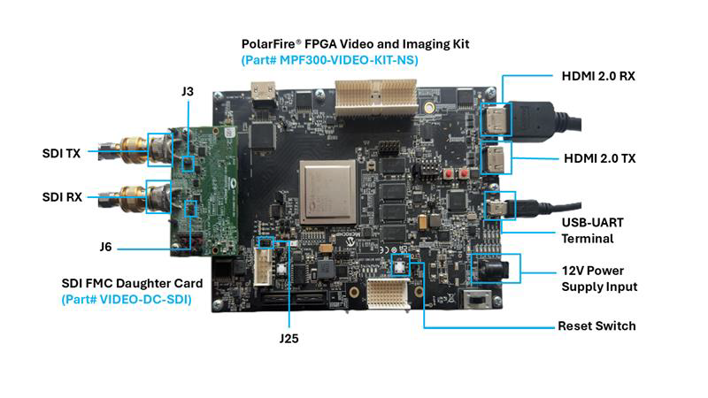

<b>Figure 1.</b> Hardware Setup

To set up the hardware, perform the following steps:

1. Connect the SDI Daughter Card to the PolarFire Video Kit using the FMC connector.
2. Configure the jumper settings on the PolarFire Video Kit:
   - Set jumper J25 to connect pins 3 and 4.
   - Verify additional jumper settings as detailed in the "Jumper Settings" section of the [UG0856: PolarFire FPGA Video Kit User Guide](https://ww1.microchip.com/downloads/aemDocuments/documents/FPGA/ProductDocuments/UserGuides/PolarFire_FPGA_Video_Kit_UG0856_V2.pdf).
3. Configure the jumper settings on the SDI Daughter Card; J3 jumper must not be connected.
4. Connect the host PC to the PolarFire Video Kit through the USB mini port (J12) using a USB mini cable for FPGA programming using FTDI chip and UART messages.
5. For **SDI to HDMI Conversion**:
   - Use a 12G-Compliant SDI BNC Cable to connect the SDI source to the HD_RX port (J2) on the SDI Daughter Card.
   - Connect the HDMI sink to the HDMI 2.0 HDMI_TX port (J1) on the PolarFire Video Kit with an HDMI cable.
6. For **HDMI to SDI Conversion**:
   - Use a 12G-Compliant SDI BNC Cable to connect the SDI sink to the HD_TX port (J1) on the SDI Daughter Card.
   - Connect the HDMI source to the HDMI 2.0 HDMI_RX port (J35) on the PolarFire Video Kit with an HDMI cable.

### (Optional) Setting up the Serial Terminal

To set up the serial terminal, perform the following steps:

1. Connect USB cable at J12 port on the PolarFire Video Kit board to the host PC.
2. After connecting the power adapter to the board at J20, switch **ON** the board's power supply using the SW4 switch. This must detect the USB UART chip on the board at the host PC. You can confirm this at the host PC device manager.
3. Choose **COM Port** labeled with **FP5 Serial Converter C** in **Device Manager**.
4. An application like **MobaXterm/TeraTerm** at the host PC is required to establish serial communication with the Video Kit. The baud rate for such connections must be 115200 bps.

## Running the Demo

### SDI to HDMI

To run the demo for SDI to HDMI conversion, perform the following steps:

1. Configure the SDI source to generate the desired resolution.
2. Verify the output on the HDMI monitor or analyzer:
   - Power on the HDMI monitor or analyzer connected to the PolarFire® Video Kit.
   - Confirm that the video resolution and audio output on the HDMI monitor or analyzer match the video and audio generated by the SDI source.

LEDs on the video kit show the following:

- **LED4** — SDI RX alignment status
- **LED3** — HDMI TX PLL lock
- **LED2** — SDI TX PLL lock
- **LED1** blinking — indicates code is executing from processor

*(Optional)* The UART prints display the following information:

- SDI datarate
- Video resolution

### HDMI to SDI

To run the demo for HDMI to SDI conversion, perform the following steps:

1. Configure the HDMI source to generate the desired resolution.
2. Verify the output on the SDI monitor or analyzer:
   - Power on the SDI monitor or analyzer connected to the SDI FMC card.
   - Confirm that the video resolution and audio output on the SDI monitor or analyzer match the video and audio generated by the HDMI source.

*(Optional)* The UART prints display the following information:

- HDMI datarate
- Video resolution

> **Notes:**
> - The SDI output jitter has been characterized using a separate hardware setup, and the results confirm that the jitter remains within the limits defined by the SDI specification. For detailed results, see the PolarFire SDI Characterization Document [*CR0050 – PolarFire FPGA SDI Protocol Solution Characterization Report*](https://ww1.microchip.com/downloads/aemDocuments/documents/FPGA/ProductDocuments/SupportingCollateral/Microsemi_PolarFire_FPGA_SDI_Protocol_Solution_Characterization_Report_CR0050_V3.pdf).
> - For this demo, the SDI output jitter is influenced by the jitter performance of the 148.5 MHz oscillator (Y5) used on the PolarFire Video kit.

The 12G data rate operation requires a 1.05 V VDDA supply to the PolarFire FPGA device. On the PolarFire video kit, this supply level can be configured by changing the appropriate resistor settings as shown in [Figure 2](#figure-2-vdda-resistor-settings-for-12g-operation).

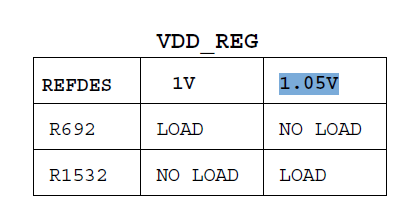

<b>Figure 2.</b> VDDA Resistor Settings for 12G Operation

## Design Resource Utilization

The following tables list the resource utilization of the SDI/HDMI Bidirectional Converter demo on the PolarFire® FPGA MPF300T-1FCG1152 device. These values might vary slightly for different Libero® runs, settings and seed values.

 

  
<b>Overall Resource Utilization</b>

| Resource | Used | Available | Utilization |
| :--- | :---: | :---: | :---: |
| 4LUT | 82,600 | 299,544 | 27.58% |
| DFF | 62,993 | 299,544 | 21.03% |
| User I/O (single-ended) | 24 | 512 | 4.69% |
| µSRAM (64×12) | 507 | 2,772 | 18.29% |
| LSRAM (20K) | 254 | 952 | 26.68% |
| Math (18×18) | 24 | 924 | 2.60% |
| H-Chip Global | 24 | 48 | 50.00% |
| Local Global | 16 | 1,008 | 1.59% |
| PLL | 7 | 8 | 87.50% |
| Transceiver Lanes | 5 | 16 | 31.25% |
| TX PLL | 2 | 11 | 18.18% |
| XCVR Reference Clock | 3 | 11 | 27.27% |
| NGMUX | 1 | 12 | 8.33% |

 

  
<b>Table 6.</b> Per-Module Resource Utilization

  | Module Name                     | 4LUT (Fabric & Interface) | DFF (Fabric & Interface) | µSRAM (64x12) | LSRAM (20K) |
  | ------------------------------- | :-----------------------: | :----------------------: | :-----------: | :---------: |
  | CORERESET_PF_C0_0               |             1             |            17            |       0       |      0      |
  | clocks_and_reset_1              |             1             |            17            |       0       |      0      |
  | color_conversion_1              |            1428           |           1307           |       0       |      0      |
  | audio_cts_mapper_0              |             54            |            0             |       0       |      0      |
  | SDI_RX_C0_0                     |           25254           |          15658           |       4       |     124     |
  | SDI_TX_C0_0                     |           12570           |           7855           |       0       |     69      |
  | SDI_Clocks_Resets_1             |             3             |            32            |       0       |      0      |
  | PF_XCVR_ERM_C0_0 (SDI)          |            294            |           107            |       0       |      0      |
  | HDMI_RX_C0_0                    |           11618           |          15699           |      72       |      8      |
  | HDMI_TX_C0_0                    |           16660           |          14301           |      399      |      1      |
  | HDMI_Clocks_Resets_1            |             2             |            32            |       0       |      0      |
  | PF_XCVR_ERM_C1_0 (HDMI)         |             0             |            0             |       0       |      0      |
  | MIV_RV32_C0_0                   |            6694           |           2486           |      20       |      0      |
  | COREAXI4INTERCONNECT_C0_0       |            3934           |           3035           |       2       |     20      |
  | COREAXITOAHBL_C0_0              |            826            |           327            |       6       |      0      |
  | COREAHBTOAPB3_C0_0              |             14            |            54            |       0       |      0      |
  | CoreAPB3_C0_0                   |             66            |            0             |       0       |      0      |
  | CoreGPIO_C0_0                   |            437            |           352            |       0       |      0      |
  | CoreUARTapb_C0_0                |            136            |           109            |       0       |      0      |
  | CORESPI_C0_0                    |            394            |           290            |       4       |      0      |
  | COREI2C_C0_0                    |            374            |            99            |       0       |      0      |
  | COREJTAGDEBUG_C0_0              |            253            |            17            |       0       |      0      |
  | PF_SRAM_AHBL_AXI_C0_0           |            1557           |           1190           |       0       |     32      |
  | debounce_0                      |             24            |            26            |       0       |      0      |

## Design Overview

This section provides a description of the design.

### Data Path

The following block diagram illustrates the high-level architecture of the demo design, which performs the SDI/HDMI bidirectional converter with dynamic data rate support.

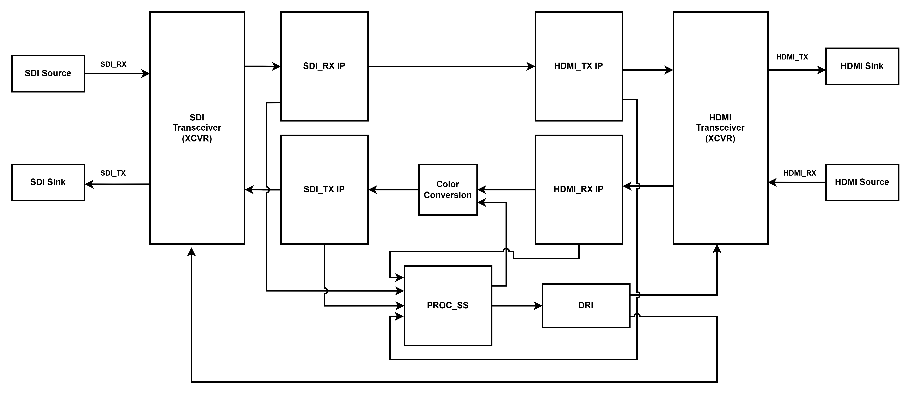

<b>Figure 3.</b> High-Level Architecture of the Demo Design

The following list provides the data flow for **SDI to HDMI** conversion:

1. **Video Acquisition**: The process starts with SDI RX sources (such as cameras, SDI Analyzers or SDI Devices) sending video and audio signals through an SDI BNC cable to the HD_RX Port on the SDI FMC Daughter Card.
2. **Data Extraction**: The SDI Transceiver (XCVR) first receives the SDI signal and converts it electrically and protocol-wise. Then, the SDI RX IP block extracts the video and audio data from this signal.
3. **Protocol Conversion**: The video data is processed by the HDMI TX IP block, which reformats the video and audio into the HDMI protocol.
4. **Transmission**: The HDMI-formatted video is transmitted by the HDMI Transceiver (XCVR). The signal is routed through the HDMI_TX port on the board.
5. **Display**: Finally, the HDMI signal is sent through an HDMI cable to an HDMI Sink (Monitor/Analyzer) for display.
6. **Control and Link Management**:
   - **Link Data Rate Configuration through PROC_SS**: SDI link configuration and management starts with identifying the incoming SDI data rate and LOCKING onto the SDI Speed. First, MIV processor reads the SDI data rate from the reclocker M23544G on SDI FMC Daughter Card using SPI interface. Then, configure the SDI RX Transceiver to corresponding SDI data rate and update the SDI_DATA_RATE register information through the AXI4-Lite register map.
   - **SDI RX IP Detection and Extraction**: The SDI RX IP core detects the incoming SDI data rate and provides the RATE_LOCKED information if the incoming SDI serial data rate and configured SDI_DATA_RATE of SDI RX IP match. It also decodes video resolution, format, and standard from the source, extracting the Video Identification Code (VIC), Color depth, Color format, and timing parameters for characterization.
   - **Data Flow and Processing in PROC_SS**: SDI RX IP RATE_LOCKED information is transmitted to the processing subsystem (PROC_SS), where the MIV processor (Microchip's RISC-V® implementation) configures the HDMI TX XCVR for the locked DATA_RATE.
   - **Configuration and Transceiver Initialization**: Configuration occurs through AXI4-Lite (for IP register access) and the Dynamic Reconfiguration Interface (DRI, for setting matching data rates), ensuring Transceiver (XCVR) compatibility with the detected format and rate for reliable video transmission/reception across standards.

The following list provides the data flow for **HDMI to SDI** conversion:

1. **Video Acquisition**: The process starts with HDMI RX sources (such as cameras, computers or media players) sending video and audio signals through an HDMI cable to the HDMI RX Port on the board.
2. **Data Extraction**: The HDMI Transceiver (XCVR) first receives the HDMI signal and converts it electrically and protocol-wise. Then, the HDMI 2.0 RX IP block extracts the video and audio data from this signal.
3. **Color Space Conversion**: The video data extracted from the source passes through the color conversion block. This block dynamically selects the processing path based on the input color format, color depth, and the target SDI transmission format. The configuration is done using the GPIO[2:1] select pins, which are driven by SoftConsole. RGB and YCbCr 4:4:4 inputs are converted into YCbCr 4:2:2; and inputs already matching the selected SDI output format are passed through unmodified.
   *Example:* For a 4K60 8-bit RGB input (VIC 97), the color conversion block converts the RGB data to YCbCr 4:2:2 before forwarding to the 12G-SDI transmitter. RGB is not a supported SDI payload at this resolution and frame rate according to SMPTE ST 2082-10.
4. **Protocol Conversion**: The video data is processed by the SDI TX IP block, which reformats the video and audio into the SDI protocol.
5. **Transmission**: The SDI-formatted video is transmitted by the SDI Transceiver (XCVR). The signal is routed through an FMC Connector to an SDI Daughter Card.
6. **Display**: Finally, the SDI signal is sent through a BNC cable from the SDI Daughter Card to an SDI Sink (Monitor/Analyzer) for display.
7. **Control and Link Management**:
   - **HDMI IP Detection and Extraction**: The HDMI IP core automatically detects the incoming video resolution, format and standard from the source, extracting the VIC, Color depth, Color format, and timing parameters for characterization.
   - **Data Flow and Processing in PROC_SS**: Extracted video information (VIC, Color depth, Color format, and timing parameters) is transmitted to the processing subsystem (PROC_SS), where the MIV processor (Microchip's RISC-V® implementation) interprets the VIC, Color depth, and Color format, assesses downstream interface requirements and initiates configuration of HDMI/SDI IPs and transceivers.
   - **Configuration and Transceiver Initialization**: Configuration occurs through AXI4-Lite (for IP register access) and the Dynamic Reconfiguration Interface (DRI, for setting matching data rates), ensuring Transceiver (XCVR) compatibility with the detected format and rate for reliable video transmission/reception across standards.

### Libero Design Implementation

The following figure shows the Libero® SoC implementation of the top-level SmartDesign. In this configuration, SmartDesign provides a graphical interface within the Libero SoC tool suite, enabling users to integrate and configure various IP cores and system components.

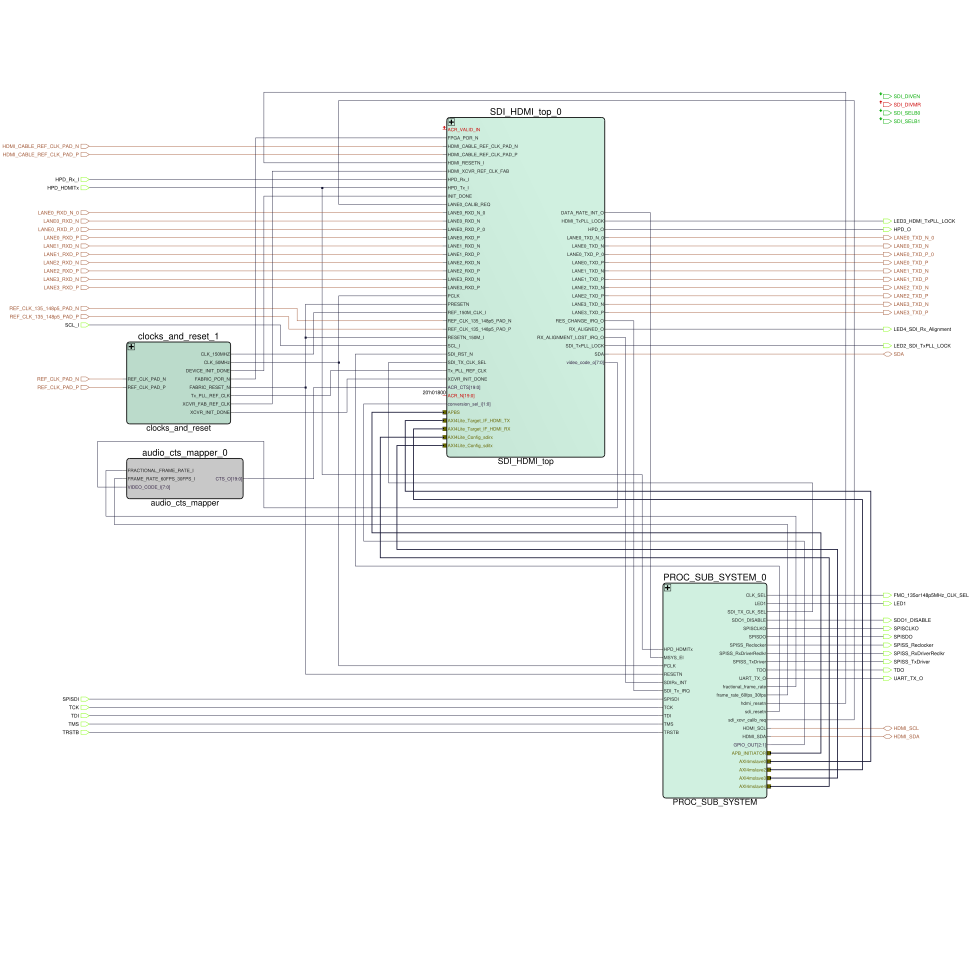

<b>Figure 4.</b> Libero SoC Top-Level SmartDesign Implementation

### Transceiver and IP Configuration

This section provides the details on the configuration of Transceivers and IPs.

#### HDMI XCVR Configuration

Key configuration details for the HDMI XCVR:

- The transceiver is configured exclusively in Tx and Rx (Independent) Mode.
- Four Rx lanes are used, each connected to the HDMI RX IP core, providing a total interface width of 40 bits for high-speed data transfer.
- Four Tx lanes are used, each connected to the HDMI TX IP core, providing a total interface width of 40 bits for high-speed data transfer.
- The Physical Medium Attachment (PMA) settings of the transceiver are managed dynamically through the DRI unit. Enabling the DRI allows for real-time adjustment of transceiver parameters, ensuring optimal performance and compatibility with different HDMI input conditions.

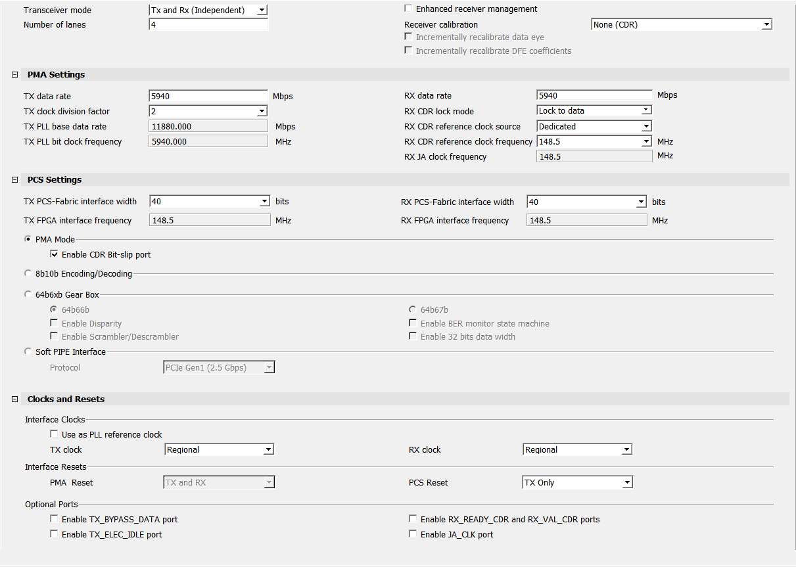

<b>Figure 5.</b> HDMI XCVR Configurator Window

#### SDI XCVR Configuration

Key configuration details for the SDI XCVR:

- The transceiver is configured exclusively in Transmit (Tx) mode for SDI output.
- Tx lane 0 is connected to the SDI TX IP core, using an 80-bit interface width to support high-speed SDI data transmission.
- Rx lane 0 is connected to the SDI RX IP core, using an 80-bit interface width to support high-speed SDI data transmission.
- The Physical Medium Attachment (PMA) and Physical Coding Sublayer (PCS) settings are dynamically managed through the DRI unit. By enabling the DRI, the design allows for real-time adjustment of transceiver parameters, ensuring optimal performance and adaptability to different SDI data rates and standards.

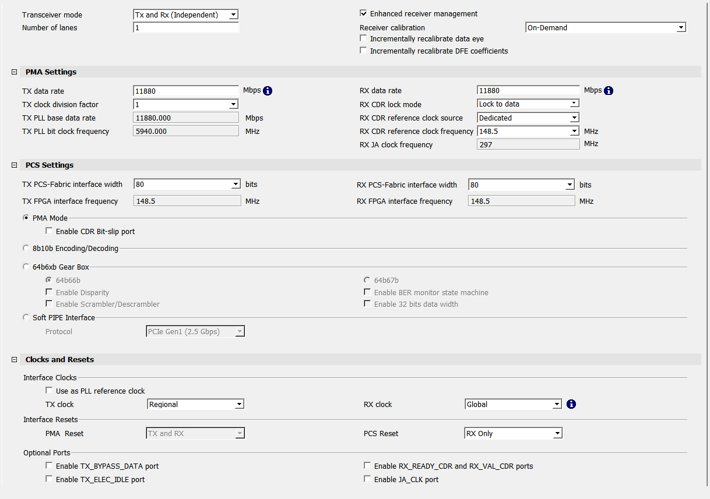

<b>Figure 6.</b> SDI XCVR Configurator Window

#### Dynamic Reconfiguration Interface Configurator

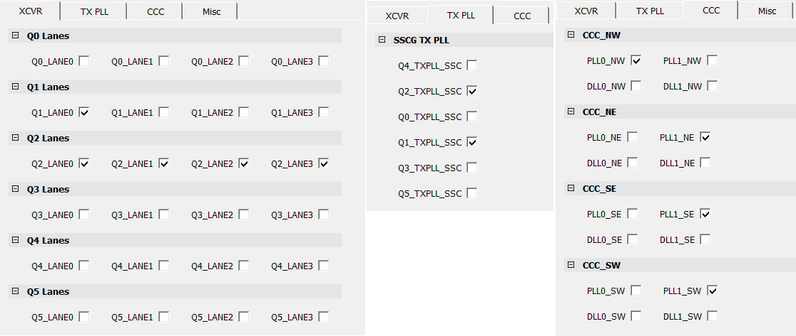

<b>Figure 7.</b> Dynamic Reconfiguration Interface (DRI) Configurator Window

#### HDMI_RX IP Configuration

The HDMI_RX IP should be configured for 8-bit, 10-bit or 12-bit color depth with four pixels per clock, two-channel audio enabled and the scrambler feature enabled.

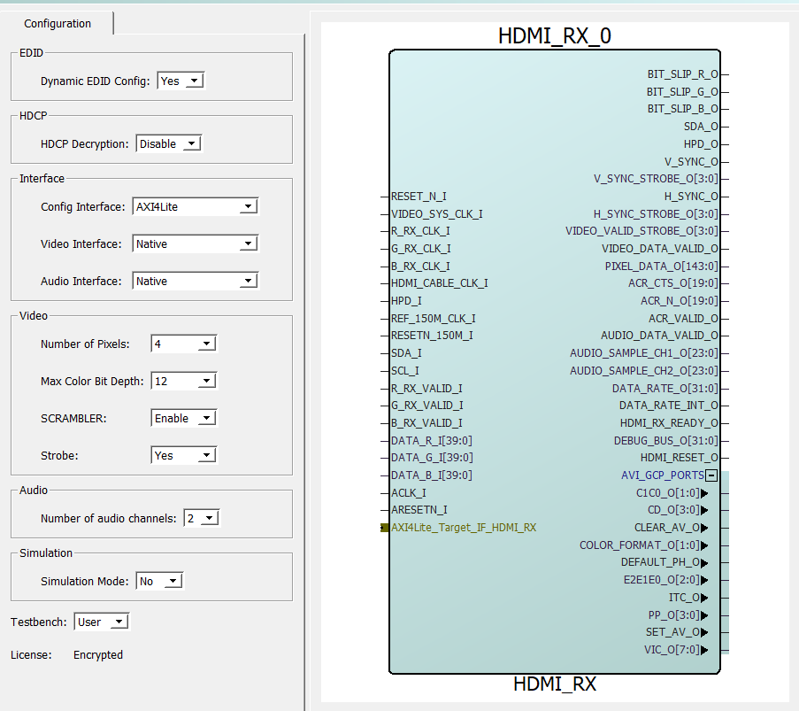

<b>Figure 8.</b> HDMI_RX IP Configurator Window

#### HDMI_TX IP Configuration

The HDMI_TX IP should be configured for 8-bit, 10-bit or 12-bit color depth with four pixels per clock, two-channel audio enabled and the scrambler feature enabled.

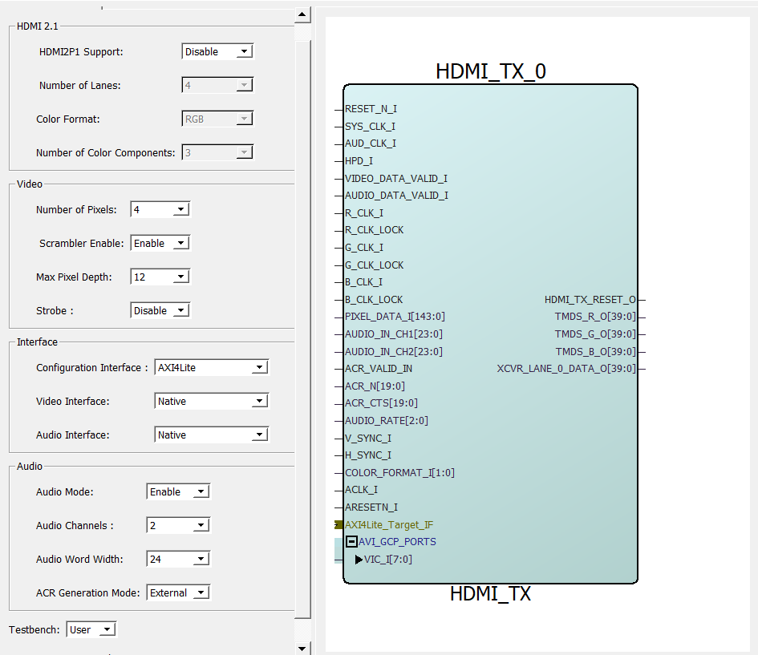

<b>Figure 9.</b> HDMI_TX IP Configurator Window

#### SDI TX IP Configuration

The SDI TX IP should be configured with 8-bit, 10-bit or 12-bit pixel width, two channel audio enabled and the Resolution Auto Detect feature must be enabled to support dynamic data rate operation.

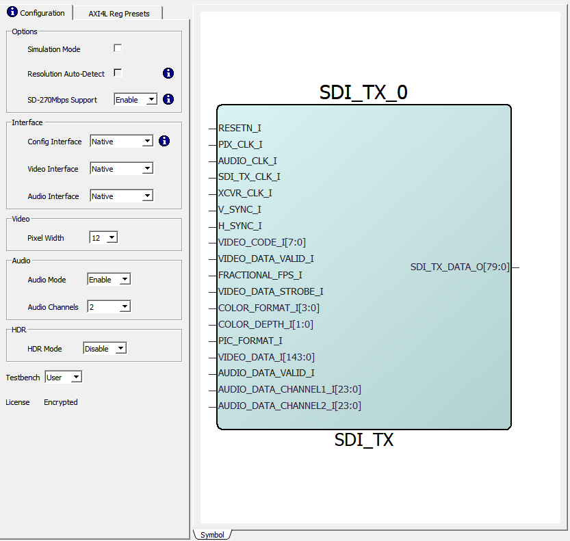

<b>Figure 10.</b> SDI TX IP Configurator Window

#### SDI RX IP Configuration

The SDI RX IP should be configured with 8-bit, 10-bit or 12-bit pixel width, AXI4-Lite configuration, and Video and Audio in Native Interface. By default, this core supports audio with two channels and four Pixels Video Mode in YUV422, YUV444 and RGB format.

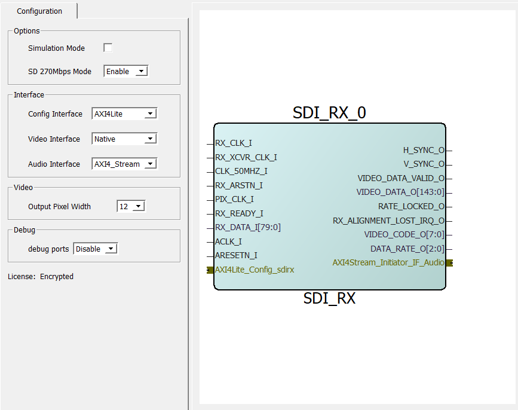

<b>Figure 11.</b> SDI RX IP Configurator Window

### Clocking Structure

The following figure shows the clocking structure of the design.

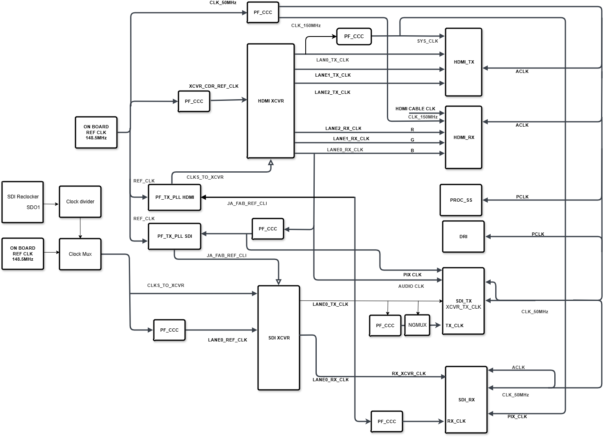

<b>Figure 12.</b> Clocking Structure

The design uses a single external clock source and generates all required clocks through the XCVR CDR and JA TX PLL:

- **148.5 MHz on-board oscillator**: This oscillator provides a reference clock to the SDI XCVR, HDMI XCVR TX PLLs, which generates the high-speed clocks required by the Transceiver (XCVR). It also serves as the reference for the CCC which generates CDR reference clock for HDMI XCVR Clock Data Recovery (CDR) circuits, ensuring accurate data sampling and transmission. The reference clock to the Fabric PLL, which generates the 150 MHz and 50 MHz clocks.
- **Reference clock from SDI FMC Daughter Card**: The SDI FMC Daughter Card includes a 148.5 MHz oscillator and an SDI reclocker. The reclocker is configured to output the recovered clock on its SDO1 pin, which is routed to a clock divider. A multiplexer selects between the clock divider output and the 148.5 MHz oscillator. The multiplexer output is used as the CDR reference clock for the SDI Rx transceiver (XCVR). For 270 Mbps SDI operation, the multiplexer selects the divided recovered clock, and the XCVR operates in clock-to-reference mode with 10× oversampling (2.7 Gbps). For all other SDI data rates, the multiplexer is configured for the 148.5 MHz reference clock.
- **Internally generated clocks within the FPGA**:
  - **150 MHz Reference Clock**: Derived from the 148.5 MHz oscillator through the Clock Conditioning Circuit (CCC), this clock is used as the reference for the HDMI_RX IP and REF_CLK150M_I clock port.
  - **50 MHz Clock**: Derived from the 148.5 MHz on-board oscillator through the CCC. This clock signal provides a stable reference for the processor subsystem and the DRI module. The SDI TX, SDI RX, HDMI TX and HDMI RX IPs use this clock for AXI4-Lite configuration interfaces. It is also used by the SDI TX and SDI RX IPs for automatic resolution detection.
  - **HDMI B Clock (HDMI_RX LANE0_RX_CLK)**: The HDMI B Clock is derived from the lane 0 of the HDMI_RX transceiver. This clock is used to sample the output data from the HDMI receiver (HDMI_RX) and is essential for subsequent data processing. This clock signal is distributed to Color Conversion Module (CLOCK_I), SDI_TX Pixel Clock (PIX_CLK), Audio Clock (AUDIO_CLK). It also provides a reference clock to the SDI XCVR JA TX_PLL and JA_FAB_REF_CLK ports through the Fabric CCC (for providing Fabric clock routing path between different XCVR quads).
  - **LANE0_CLK REF**: Derived from the LANE0_CDR_REF_CLK through the CCC. This clock is used as the lane0 reference clock in SDI XCVR receiver side.
  - **SDI XCVR Receiver LANE0_RX_CLK**: This clock is derived from the Lane 0 of SDI XCVR receiver and is used to sample the output data from the SDI XCVR receiver and is essential for subsequent data processing. It is distributed to RX_XCVR_CLK_I of SDI_RX IP and it also provides a reference clock to the JA_FAB_REF_CLK of HDMI TX_PLL.
  - **HDMI XCVR Transmitter LANE0_TX_CLK**: This clock is derived from the Lane 0 of the HDMI XCVR transmitter and is essential for subsequent data processing. It is distributed to SDI_RX PIX_CLK_I and HDMI_TX SYS_CLK_I through PF_CCC.
  - **SDI XCVR Transmitter LANE0_TX_CLK**: This clock is derived from the Lane 0 of SDI XCVR Transmitter and is used to sample the output data from the SDI XCVR transmitter. It is distributed to SDI TX XCVR_CLK_I input port.

### Reset Structure

This design uses the CoreReset_PF IP to synchronize resets across the respective clock domains. The following figure shows the reset structure of the design.

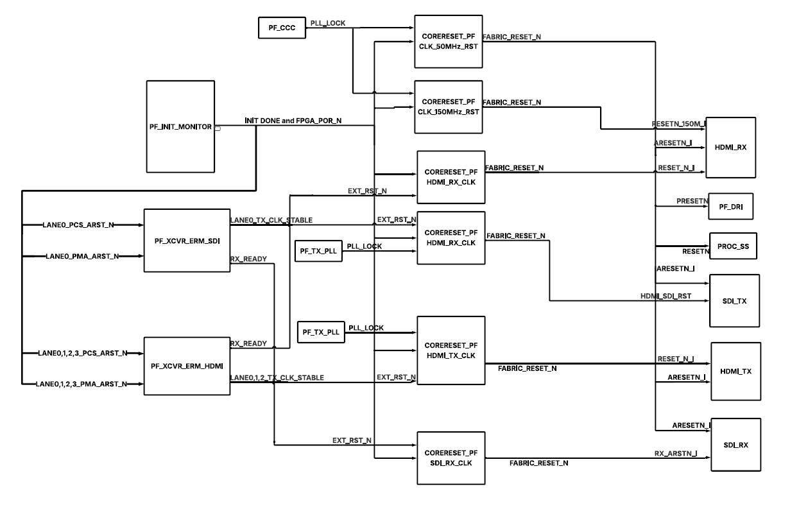

<b>Figure 13.</b> Reset Structure

## Appendix A: Running the Tcl Script

Tcl scripts are provided in the [`hw/`](hw/) folder to regenerate the Libero project for the SDI/HDMI Bidirectional Converter Design with Dynamic Rate Support.

To run the Tcl flow, perform the following steps:

1. Launch the Libero® SoC software.
2. Click **Project** > **Execute Script**.
3. Browse to the [`hw/`](hw/) folder in this repository and select `script.tcl`.
4. Click **Run**.

After successful execution, the Libero project is created inside the `hw/` directory.

The full Tcl folder structure, per-file description, validated Libero version, and IP-core version list are documented in [`hw/README.md`](hw/README.md). For Tcl command syntax, see the [*Libero SoC Tcl Command Reference Guide*](https://coredocs.s3.amazonaws.com/Libero/2025_1/Tool/libero_soc_tcl_cmd_ref_ug.pdf). For any queries about running the Tcl script, contact [Microchip Technical Support](https://www.microchip.com/support).

## Appendix B: Programming with FlashPro Express

This appendix describes how to program the PolarFire device with the `mpf300_video_kit_sdi_hdmi.job` file using FlashPro Express.

To program the device, perform the following steps:

1. Extract the programming `.job` file (`mpf300_video_kit_sdi_hdmi.job`) from the packaged archive `mpf300-video-kit-sdi-hdmi_vxxxx.x_Job.zip` downloaded from the [GitHub Releases](https://github.com/microchip-fpga-solutions/mpf300-video-kit-sdi-hdmi/releases) page.
2. Connect USB cable at J12 port on the PolarFire Video Kit board to the host PC.
3. After connecting the power adapter to the board at J20, switch on the board's power supply using the SW4 switch. The host PC should detect the USB UART chip. You can confirm the detection in the **Device Manager** on the host PC.
4. On the host PC, from Windows **Start** menu, launch the **FlashPro Express** software.
5. To create a new job project on the **Task Bar**, click **New** or **Project** and then select **New Job Project**.
6. In the **Create New Job Project** dialog box, enter the following:
   - In the Import FlashPro Express job file: Click **Browse** and navigate to the extracted `mpf300_video_kit_sdi_hdmi.job` file, then select it.
   - In the FlashPro Express job project location: Click **Browse** and navigate to the location where you want to save the project.
7. Click **OK**. The required programming file is selected and ready to be programmed in the device.
8. The FlashPro Express window appears. Confirm that a programmer number appears in the **Programmer** field. If it does not, confirm the board connections and click **Refresh/Rescan Programmers**.
9. To program the device, click **Run**. When the device is programmed successfully, a **Run PASSED** status is displayed.
10. Close **FlashPro Express** or in the **Project** tab, click **Exit**. The PolarFire device is programmed.

## Appendix C: Troubleshooting Guide

This appendix lists common issues seen while bringing up the SDI/HDMI Bidirectional Converter demo and how to resolve them.

### Video and Signal Issues

  
<b>Table 7.</b> Video and Signal Issues

| Symptom | Likely Cause | Fix |
| :--- | :--- | :--- |
| No video on the HDMI sink (SDI → HDMI path) | SDI RX not locked to source, or SDI Daughter Card not fully seated | Verify **LED4** is ON (SDI RX aligned). Reseat the FMC connection. Confirm the SDI source is generating one of the resolutions listed in [Table 1](#table-1-supported-sdi-to-hdmi-20-video-and-audio-resolutions). |
| No video on the SDI sink (HDMI → SDI path) | HDMI RX not locked to source, or SDI TX PLL not locked | Confirm the HDMI source is generating one of the resolutions listed in [Table 2](#table-2-supported-hdmi-20-to-sdi-video-and-audio-resolutions). Verify **LED2** is ON (SDI TX PLL locked). |
| Blank / snow / momentary glitch on sink when input resolution changes | Runtime reconfiguration in progress | Wait a few seconds for the design to relock. If it does not recover, power-cycle the source and reconfirm the source resolution is supported. |

### LED Status Decoding

The board LEDs provide a first-look health check. If video is missing, the LED pattern usually indicates which stage of the pipeline is failing.

  
<b>Table 8.</b> LED Status Decoding

| LED | Normal state | If OFF or misbehaving |
| :---: | :--- | :--- |
| **LED1** | Blinking at approximately 1 Hz — MIV processor is executing firmware | If not blinking: the design did not program correctly, or the eNVM/processor image is missing. Reprogram using FlashPro Express. |
| **LED2** | ON — SDI TX PLL is locked | If OFF: SDI TX is not producing a valid clock. Check that the 148.5 MHz on-board oscillator is running and jumpers on the SDI Daughter Card are set correctly. |
| **LED3** | ON — HDMI TX PLL is locked | If OFF: HDMI TX cannot lock to the required pixel clock. Verify the HDMI cable to the sink is connected and the sink is powered on (some sinks pull the HDMI transmitter into low-power mode when they are off). |
| **LED4** | ON — SDI RX is aligned to the incoming SDI stream | If OFF: no valid SDI signal is being received. Verify the SDI source is generating, the BNC cable is connected to the HD_RX port (J2) on the SDI Daughter Card, and the source data rate is in the supported list. |

### Serial and UART Issues

  
<b>Table 9.</b> Serial and UART Issues

| Symptom | Likely Cause | Fix |
| :--- | :--- | :--- |
| No COM port appears in Device Manager | USB cable not fully seated at J12, or FTDI USB-to-UART driver not installed | Reseat the USB mini cable. Install the FTDI driver package. In Device Manager the port should appear as **FP5 Serial Converter C**. |
| COM port present but no UART output | Wrong COM port selected, or terminal not configured to 115200 8N1 | In your terminal (TeraTerm / MobaXterm / PuTTY), select the **FP5 Serial Converter C** port and set baud rate = **115200**, data = 8 bits, parity = none, stop = 1 bit, flow control = none. |
| UART shows garbled characters | Baud-rate mismatch | Reset the terminal baud rate to **115200 bps**. |

### Hardware Setup Issues

  
<b>Table 10.</b> Hardware Setup Issues

| Symptom | Likely Cause | Fix |
| :--- | :--- | :--- |
| SDI Daughter Card is not detected / SDI paths dead | FMC connector not fully seated | Power off the board, reseat the SDI Daughter Card onto the FMC connector on the PolarFire Video Kit, secure the retention screws, and power on. |
| Board does not power up | SW4 in OFF position, or 12 V adapter not connected at J20 | Confirm the 12 V power pack is connected to J20 and SW4 is set to ON. |
| No SDI output regardless of input | J3 jumper on the SDI Daughter Card is installed | J3 **must not** be connected for this design. Remove the J3 jumper. |
| SDI or HDMI Tx PLL fails to lock at power-on | J25 jumper on the Video Kit not set correctly | Set jumper **J25 pins 3–4**. Verify remaining jumper settings against the [UG0856: PolarFire FPGA Video Kit User Guide](https://ww1.microchip.com/downloads/aemDocuments/documents/FPGA/ProductDocuments/UserGuides/PolarFire_FPGA_Video_Kit_UG0856_V2.pdf). |
| 12G-SDI operation intermittent or fails | VDDA supply is 1.00 V instead of 1.05 V | Change the resistor settings on the PolarFire Video Kit to select 1.05 V VDDA. See [Figure 2](#figure-2-vdda-resistor-settings-for-12g-operation). |

### Unsupported Resolution or Data Rate

If the input source generates a resolution, frame rate, or color-format combination that is not listed in [Table 1](#table-1-supported-sdi-to-hdmi-20-video-and-audio-resolutions) or [Table 2](#table-2-supported-hdmi-20-to-sdi-video-and-audio-resolutions):

- The sink may display no video, or a black frame, or hold the last-known-good frame.
- LED2, LED3 or LED4 may drop out to indicate which stage failed to lock.

To resolve, configure the source to one of the supported formats and reset the source (or briefly disconnect and reconnect the cable) so the design can relock.

## Documentation and Support

- **Microchip FPGA Support**: Contact the Technical Support Center at [www.microchip.com/support](https://www.microchip.com/support). Mention the FPGA Device Part number, select an appropriate case category, and upload design files while creating a technical support case.
- **Customer Service** (non-technical product support): From North America, call **800.262.1060**. From the rest of the world, call **650.318.4460**. Fax, from anywhere in the world, **650.318.8044**.
- **Referenced documents**:
  - [UG0856: PolarFire FPGA Video Kit User Guide](https://ww1.microchip.com/downloads/aemDocuments/documents/FPGA/ProductDocuments/UserGuides/PolarFire_FPGA_Video_Kit_UG0856_V2.pdf)
  - [SDI FMC Daughter Card User Guide](https://www.microchip.com/en-us/development-tool/VIDEO-DC-SDI)
  - [CR0050 — PolarFire FPGA SDI Protocol Solution Characterization Report](https://ww1.microchip.com/downloads/aemDocuments/documents/FPGA/ProductDocuments/SupportingCollateral/Microsemi_PolarFire_FPGA_SDI_Protocol_Solution_Characterization_Report_CR0050_V3.pdf)
  - [HDMI RX IP](https://www.microchip.com/en-us/products/fpgas-and-plds/ip-core-tools/hdmi-rx), [HDMI TX IP](https://www.microchip.com/en-us/products/fpgas-and-plds/ip-core-tools/hdmi-tx), [SDI TX IP](https://www.microchip.com/en-us/products/fpgas-and-plds/ip-core-tools/sdi_tx), [SDI RX IP](https://www.microchip.com/en-us/products/fpgas-and-plds/ip-core-tools/sdi_rx) user guides
  - [Libero SoC Tcl Command Reference Guide](https://coredocs.s3.amazonaws.com/Libero/2025_1/Tool/libero_soc_tcl_cmd_ref_ug.pdf)

## Glossary

| Term | Definition |
| --- | --- |
| **AXI4-Lite** | A lightweight AMBA AXI subset used for control-plane register access to IP cores. |
| **CCC** | Clock Conditioning Circuit — Microchip FPGA primitive that generates and phase-aligns derived clocks from a reference. |
| **CDR** | Clock Data Recovery — recovers a bit clock from a serial data stream. |
| **DRI** | Dynamic Reconfiguration Interface — allows runtime reconfiguration of transceiver PMA / PCS parameters. |
| **FMC** | FPGA Mezzanine Card — standardized daughter-card connector used by the SDI Daughter Card on the Video Kit. |
| **FPGA** | Field Programmable Gate Array. |
| **HDR** | High Dynamic Range video. |
| **IP core** | Reusable pre-verified logic block instantiated in the design (SDI TX/RX, HDMI TX/RX, XCVR, etc.). |
| **MIV** | Mi-V — Microchip's RISC-V® soft-processor implementation used as the design's control processor. |
| **PCS** | Physical Coding Sublayer — the transceiver layer responsible for encoding/decoding, alignment, and scrambling. |
| **PLL** | Phase-Locked Loop. |
| **PMA** | Physical Medium Attachment — the transceiver analog layer including SerDes, drivers, and CDR. |
| **PROC_SS** | Processor Subsystem — the MIV-based control block that manages IP configuration and link management. |
| **SDI** | Serial Digital Interface (SMPTE). Data rates used in this design: **270M-SDI** (SD), **1.5G-SDI** (HD), **3G-SDI** Level A/B, **6G-SDI**, **12G-SDI**. |
| **SMPTE** | Society of Motion Picture and Television Engineers — publisher of the SDI standards ST 259, ST 292, ST 424, ST 2081, and ST 2082. |
| **TX / RX** | Transmit / Receive. |
| **VDDA** | Analog supply voltage for the FPGA transceiver quads (1.00 V or 1.05 V; the higher setting is required for 12G operation). |
| **VIC** | Video Identification Code — CEA-861 numeric identifier for HDMI video timing / format. |
| **XCVR** | Transceiver — high-speed serial I/O block (PMA + PCS). |
| **YCbCr / RGB / YUV422** | Color-space representations. YCbCr 4:4:4 and RGB carry full chroma per pixel; YCbCr 4:2:2 subsamples chroma horizontally. |
